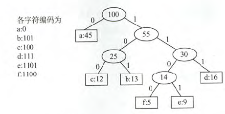

## 树

数据使用树结构存储后，出奇的高效

二分搜索树（Binary Search Tree）

平衡二叉树：AVL;红黑树

堆；并查集

线段树；Trie（字典树，前缀树）

### 二叉树 （Binary Tree）

#### 定义

二叉树或者是一颗空树，或者是一棵由一个根结点和两棵互不相交的分别称为根结点的的左子树和右子树所组成的非空树，左子树和右子树又同样都是一棵二叉树

#### 基本概念

* 结点的度：结点所拥有的子节点数的个数称为该节点的度
* 叶子节点：度为0的结点称为叶子节点
* 分支节点：度不为0的节点
* 结点的深度：从根结点开始自顶向下逐层累加的
* 结点的高度：从叶结点开始自底向上逐层累加的
* 树的深度（高度）：树中所有结点的最大层数
* 树的度：树中各节点度的最大值
* 满二叉树：一棵高度为h,并且有$2^h-1$个结点的二叉树称为满二叉树，即树中的每一个层都含有最多的结点。在一棵二叉树中，所有分支节点都存在左子树和右子树，并且所有叶子结点都在同一层上
* 完全二叉树：叶子结点只能出现在最下层和次下层，且最下层的叶子结点集中在树的左部。满二叉树肯定是完全二叉树，而完全二叉树不一定是满二叉树 。
  * 如果有度为1的结点，只可能有一个，且该结点只有左孩子而无右孩子
  * 对于n个结点的完全二叉树。若n为奇数，则每个分支节点都有左右子女；若n为偶数，则编号最大的分支结点只有左节点，没有右节点。

### 遍历

#### 深度优先遍历

* 前序遍历（pre-order traversal）：先访问根结点，再访问左子结点，最后访问右子结点。
* 中序遍历（In-Order traversal）：先访问左子结点，再访问根节点，最后访问右子节点
* 后序遍历（Post-Order Traversal）：先访问左子结点，再访问右子结点，最后访问根节点

#### 广度优先遍历

先访问树的第一层结点，再访问树的第二层结点...一直访问到最下面一层结点。在同一层结点中，以从左到右的顺序依次访问。

## 二分搜索树（Binary Search Tree）

二分搜索树是二叉树。**存储的元素必须有可比较性**

二分搜索树的每个节点的值：

* 大于其左子树的所有结点的值
* 小于其右子树的所有结点的值

每一棵子树也是二分搜索树。

如果想包含重复元素的话，只需要定义：

左子树小于等于父结点；或者右子树大于等于父结点

## 平衡二叉树（AVL）

在二叉搜索树的基础上，左子树、右子树高度差的绝对值不超过1.定义结点左子树与右子树的高度差为该结点的平衡因子，则平衡二叉树结点的平衡因子的值-1，0或1

### 插入

平衡二叉树保证平衡的基本思想：每当二叉搜索树中插入（或删除）一个结点时，首先要检查其插入路径上的结点是否因为此次操作而导致了不平衡。如果导致了不平衡，则先找到插入路径上离插入节点最近的平衡因子绝对值大于1的结点A，再对以A为根的子树，在保持二叉排序树特性的前提下，调整各节点的位置关系，使之重新达到平衡。

## 哈夫曼（Huffman）树

树中结点的值称为该结点的权。从树根结点到任意节点的路径长度（经过的边数）与该结点上权值的乘积称为该结点的带权路径长度。树中所有叶结点的带权路径长度之和称为该树的带权路径长度，记为

$WPL = \sum_{i=1}^{n}W_i*l_i$

wi是第i个叶结点所带的权值；li是该叶结点到根结点的路径长度

在含有N个带权叶子节点的二叉树中，其中带权路径长度（WPL）最小的二叉树称为哈夫曼树，也称为最优二叉树。

### 构造

给定N个权值分别为w1,w2,...,wn的结点

1. 将这N个结点分别作为N棵仅含一个结点的二叉树，构成森林F
2. 构造一个新结点，并从F中选取两颗根结点权值最小的树作为新结点的左、右子树，并且将新结点的权值置为左、右子树上根结点的权值之和
3. 从F中删除刚才选出的两棵树，同时将新得到的树加入F中
4. 重复步骤2和3，直到F中只剩下一棵树为止

### 特点

* 每个初始结点最终都成为叶结点，并且权值越小的结点到根结点的路径长度越大
* 构造过程中共新建了N-1个结点（双分支结点），因此哈夫曼树中结点总数为2N-1
* 每次构造都选择2棵树作为新结点的孩子，因此哈夫曼树中不存在度为1的结点。

### 哈夫曼编码

* 固定长度编码：每个字符都用同样长度的二进制位来表示

* 可变长度编码：对不同字符用不等长的二进制位表示，对频率高的赋以短编码，而对频率较低的字符赋以较长的编码，从而使字符平均编码长度减短，起到压缩数据的效果
* 前缀编码：没有一个编码是另一个编码的前缀，如0，101，100

## 堆

### 优先队列

出队顺序和入队顺序无关，和优先级相关

|              | 入队    | 出队（拿出最大元素） |
| ------------ | ------- | -------------------- |
| 普通线性结构 | O(1)    | O(n)                 |
| 顺序线性结构 | O(n)    | O(1)                 |
| 堆           | O(logn) | O(logn)              |

### 二叉堆

* 二叉堆是一棵完全二叉树
* 堆中某个节点总是不大于其父结点的值（最大堆）