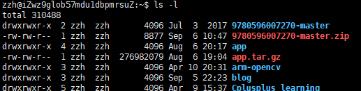

### 查看端口号

``` bash
# lsof -i :端口号
COMMAND  PID USER   FD   TYPE  DEVICE SIZE/OFF NODE NAME
mongo   2326  zzh    7u  IPv4 2655593      0t0  TCP localhost:41490->localhost:27017 (ESTABLISHED)
```

``` bash
netstat -tun
#Active Internet connections (only servers)
Proto Recv-Q Send-Q Local Address           Foreign Address         State       PID/Program name
tcp        0      0 127.0.0.1:6010          0.0.0.0:*               LISTEN      3601/0          
tcp        0      0 127.0.0.1:6011          0.0.0.0:*               LISTEN      2311/1          
tcp        0      0 0.0.0.0:27017           0.0.0.0:*               LISTEN      28494/mongod    
tcp        0      0 0.0.0.0:22122           0.0.0.0:*               LISTEN      18099/fdfs_trackerd
tcp        0      0 0.0.0.0:80              0.0.0.0:*               LISTEN      22108/nginx     
tcp        0      0 0.0.0.0:22              0.0.0.0:*               LISTEN      1170/sshd       
tcp        0      0 0.0.0.0:23000           0.0.0.0:*               LISTEN      18840/fdfs_storaged
tcp6       0      0 :::3306                 :::*                    LISTEN      15171/mysqld    
udp        0      0 172.18.236.166:123      0.0.0.0:*                           778/ntpd        
udp        0      0 127.0.0.1:123           0.0.0.0:*                           778/ntpd        
udp        0      0 0.0.0.0:123             0.0.0.0:*                           778/ntpd        
udp6       0      0 :::123                  :::*                                778/ntpd 
```

### ls、ps的内部原理

### 查看目标文件权限

``` bash
ls -l
```



 一共有十位数，其中：最前面那个 - 代表的是类型

靠前三个  ---代表的是所有者（user）拥有的权限

中间三个 --- 代表的是组群（group）拥有的权限

最后三个 --- 代表的是其他人（other）拥有的权限

**r 表示文件可以被读（read）**

**w 表示文件可以被写（write）**

**x 表示文件可以被执行（如果它是程序的话）**

**- 表示相应的权限还没有被授予**

**r ------------4**

**w -----------2**

**x ------------1**

**- ------------0**

**-rw------- (600) 只有所有者才有读和写的权限**

**-rw-r--r-- (644) 只有所有者才有读和写的权限，组群和其他人只有读的权限**

**-rwx------ (700) 只有所有者才有读，写，执行的权限**

**-rwxr-xr-x (755) 只有所有者才有读，写，执行的权限，组群和其他人只有读和执行的权限**

**-rwx--x--x (711) 只有所有者才有读，写，执行的权限，组群和其他人只有执行的权限**

**-rw-rw-rw- (666) 每个人都有读写的权限**

**-rwxrwxrwx (777) 每个人都有读写和执行的权限**