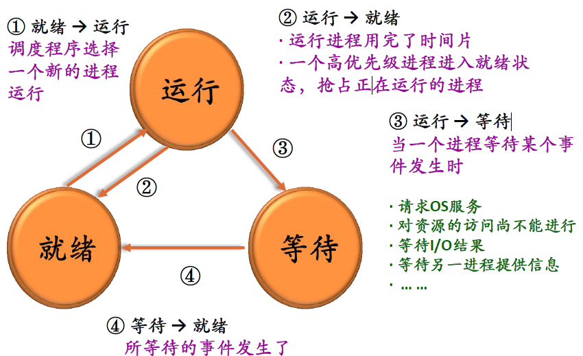
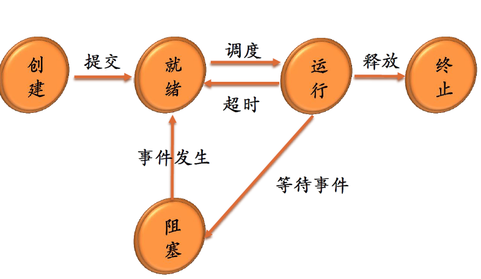
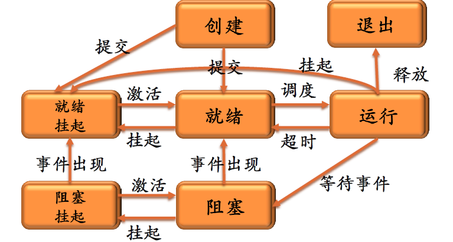
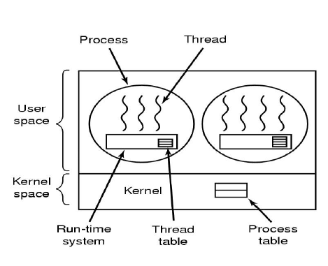
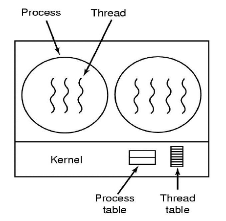

# 进程（Process）

## 概念

进程是具有独立功能的程序关于**某个数据集合上的一次运行活动**，是系统进行资源分配和**调度**的独立单位。

* 程序的一次执行过程
* 是正在运行程序的抽象
* 将一个CPU变换成多个虚拟的CPU
* 系统资源以进程为单位进行分配，每个具有**独立的地址空间**
* 操作系统将CPU调度给需要的进程

## 进程控制块 （Process control block）

PCB 又称进程描述符、进程属性。操作系统用于管理控制进程的一个专门数据结构。记录进程的各种属性，描述进程的动态变化结构。

PCB是系统感知进程存在的唯一标志（进程与PCB是一一对应的）

进程表：所有进程的PCB集合

### PCB内容

* 进程描述信息
  * 进程标识符（Process ID），唯一，通常为一个整数
  * 进程名，通常基于可执行文件名，不唯一
  * 用户标识符（user ID）
  * 进程组关系
* 进程控制信息
  * 当前状态
  * 优先级（priority）
  * 代码执行入口地址
  * 程序的磁盘地址
  * 运行统计信息（执行时间、页面调度）
  * 进程间同步和通信
  * 进程的队列指针
  * 进程的消息队列指针
* 所拥有的资源和使用情况
  * 虚拟地址空间的状况
  * 打开文件列表
* CPU现场信息
  * 寄存器值（通用寄存器、程序计数器PC、程序状态字PSW、栈指针）
  * 指向该进程页表的指针

## 进程的状态

### 三种状态

* 运行态（running）：占有CPU，并在CPU上运行
* 就绪态(Ready)：已经具备运行条件，但由于没有空闲CPU，而暂时不能运行
* 等待态（waiting/blocked 阻塞态、封锁态、睡眠态）：因等待某一事件而暂时不能运行

#### 状态转换



### 五种状态



### 七种状态



## 进程队列

* 操作系统为每一类进程建立一个或多个队列
* 队列元素为PCB
* 伴随进程状态的改变，其PCB从一个队列进入另一个队列

## 进程控制

进程控制操作完成进程各状态之间的转换，由具有特定功能的原语（完成某种特定功能的一段程序，具有不可分割性或不可中断性）完成

* 进程创建原语
* 进程撤消原语
* 阻塞原语
* 唤醒原语
* 挂起原语
* 激活原语
* 改变进程优先级

### 进程创建

* 给新进程分配一个唯一标识以及进程控制块
* 为进程分配地址空间
* 初始化进程控制块
* 设置相应的队列指针

### 进程的撤销

* 收回进程所占的资源
* 撤销该进程的PCB

### 进程阻塞

处于运行状态的进程，在其运行过程中，期待某一事件发生，如等待键盘输入等。当被等待的事件未发生时，由**进程自己执行阻塞原语**，使自己由运行态变为阻塞态。

#### unix 的进程控制操作

* fork() 通过复制调用进程来建立新的进程，是最基本的进程建立过程
* exec() 包括一系列系统调用，它们都是通过用一段新的程序代码覆盖原来的地址空间，实现进程执行代码的转换
* wait() 提供初级进程同步操作，能使一个进程等待另外一个进程的结束
* exit() 用来终止一个进程的运行

#### fork 的实现

* 为子进程分配一个空闲的进程描述符
* 分配给子进程唯一标识pid
* 以一次一页的方式复制父进程地址空间
* 从父进程继承共享资源，如打开的文件和当前工作目录
* 将子进程的状态设为就绪，插入到就绪队列
* 对子进程返回标识符0
* 向父进程返回子进程的pid

``` c
#include <sys/types.h>
#include <stdio.h>
#include <unistd.h>
void main(int argc ,char *argv[])
{
    pid_t pid;
    pid = fork();
        if(pid<0){
            fprintf(stderr,"fork failed");
            exit(-1);
        }else if (pid == 0){
            execlp("/bin/ls","ls",NULL);
        }else {
            wait(NULL);
            printf("child complete");
            exit(0);
        }
}
```

## 进程与程序的区别

* 进程更能准确刻画并发，而程序不能
* 程序是静态的，进程是动态的
* 进程是有生命周期的，有诞生有消亡，是短暂的；而程序是相对长久的
* 一个程序可对应多个进程
* 进程具有创建其他进程的功能

## 进程映像（image）

对进程执行活动全过程的静态描述。由进程地址空间内容、硬件寄存器内容及与该进程相关的内核数据结构、内核栈组成。

* 用户相关：进程地址空间（包括代码段、数据段、堆和栈、共享库...）
* 寄存器相关：程序计数器、指令寄存器、程序状态寄存器、栈指针、通用寄存器等的值
* 内核相关：
  * 静态部分：PCB及各种资源数据结构
  * 动态部分：内核栈（不同进程在进入内核后使用不同的内核栈）

## 上下文切换

将CPU硬件状态从一个进程换到另一个进程的过程称为上下文切换

* 进程运行时，其硬件状态保存在CPU上的寄存器（程序计数器、程序状态寄存器、栈指针、通用寄存器、其他控制寄存器的值）中。
* 进程不运行时，这些寄存器的值保存在进程控制块PCB中。当操作系统要运行一个新的进程时，将PCB中的相关值送到对应的寄存器中

# 线程

## 概念

进程中的一个运行实体，是CPU的调度单位

## 属性

* 有标识符ID
* 有状态及状态转换
* 有上下文环境：程序计数器等寄存器
* 有自己的栈和栈指针
* 共享所在进程的地址空间和其他资源
* 可以创建、撤销另一个线程

## 线程的实现

### 用户级线程（User level thread）

例如unix

* 在用户空间建立线程库：提供一组管理线程的过程
* 运行时系统：完成系统的管理工作（操作、线程表）
* 内核管理的还是进程，不知道线程的存在
* 线程切换不需要内核态特权



#### 优点

* 线程切换快
* 调度算法是应用程序特定的
* 用户级线程可运行在任何操作系统上（只需要实现线程库）

#### 缺点

* 内核只将处理器分配给进程，同一进程中的两个线程不能同时运行于两个处理器上
* 大多数系统调用是阻塞的，因此，由于内核阻塞进程，故进程中所有线程也被阻塞

### 核心级线程（kernel level thread）

* 内核管理所有线程管理，并向应用程序提供API接口
* 内核维护进程和线程的上下文
* 线程的切换需要内核支持
* 以线程为基础进行调度



### 混合模型

* 线程创建在用户空间完成
* 线程调度等在核心态完成