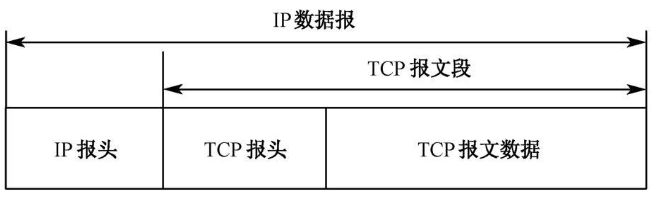
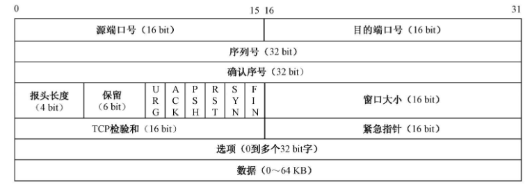
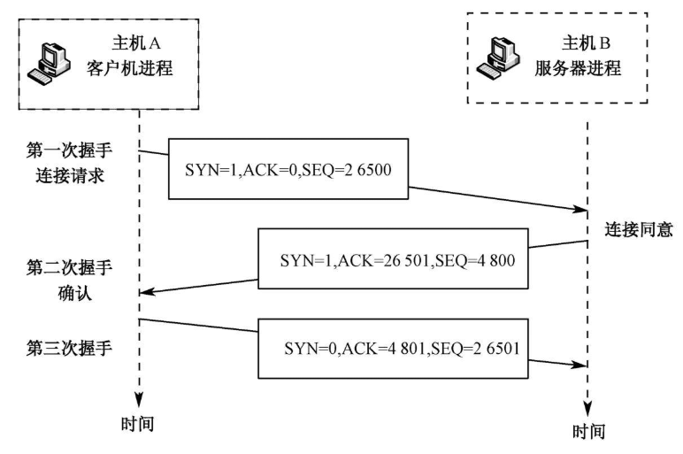
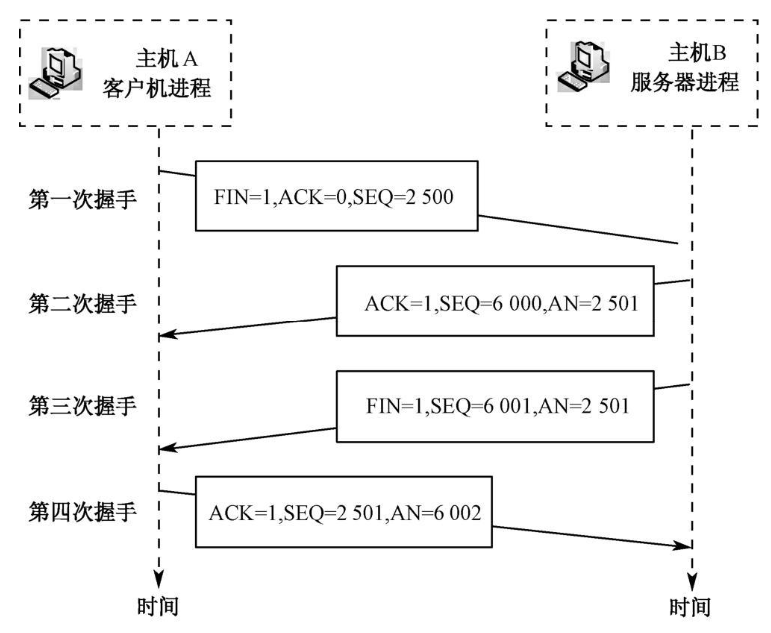
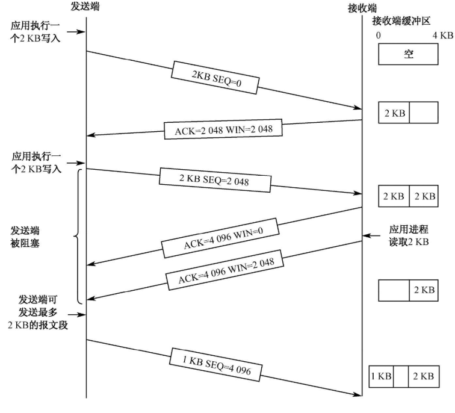
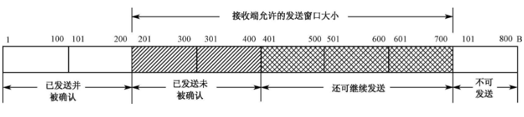
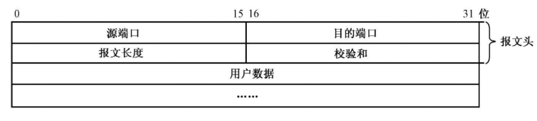

## OSI 

开放式系统互联参考模型(Open System Interconnection Reference Model)

|                               |                                                              |                                                              |
| ----------------------------- | ------------------------------------------------------------ | ------------------------------------------------------------ |
| 应用层（Application Layer）   | 提供为应用软件而设的接口，以设置与另一应用软件之间的通信     | 例如: HTTP，HTTPS，FTP，TELNET，SSH，SMTP，POP3.HTML.等      |
| 表达层（Presentation Layer）  | 把数据转换为能与接收者的系统格式兼容并适合传输的格式         |                                                              |
| 会话层（Session Layer）       | 负责在数据传输中设置和维护计算机网络中两台计算机之间的通信连接 |                                                              |
| 传输层（Transport Layer）     | 把传输表头（TH）加至数据以形成数据包。传输表头包含了所使用的协议等发送信息 | 例如TCP 、 UDP                                               |
| 网络层（Network Layer）       | 决定数据的路径选择和转寄，将网络表头（NH）加至数据包，以形成分组。网络表头包含了网络数据 | 例如IP、路由器                                               |
| 数据链路层（Data Link Layer） | 负责网络寻址、错误侦测和改错。当表头和表尾被加至数据包时，会形成帧。数据链表头（DLH）是包含了物理地址和错误侦测及改错的方法。数据链表尾（DLT）是一串指示数据包末端的字符串 | 例如以太网、无线局域网（Wi-Fi）和通用分组无线服务（GPRS）、交换机 |
| 物理层（Physical Layer）      | 在局部局域网上传送[数据帧](https://zh.wikipedia.org/wiki/数据帧)（data frame），它负责管理计算机通信设备和网络媒体之间的互通。 | 包括了针脚、电压、线缆规范、集线器、中继器、网卡、主机接口卡等 |

## TCP/IP协议

|                                  |      |                        |
| -------------------------------- | ---- | ---------------------- |
| 应用层（application layer）      |      | HTTP、FTP、DNS         |
| 传输层（transport layer）        |      | TCP 、UDP、 RTP、 SCTP |
| 网络互连层（internet layer）     |      | IP                     |
| 网络连接层（Network link layer） |      | 以太网 WIFI            |

## IP层

## 传输层

传输层向应用层提供的服务内容包括：端到端的传输、服务点寻址、可靠数据传输和流量控制等

#### 端口

由于一台计算机同时存在多个进程，所以要进行进程间的通信，首先要解决进程的标识问题。TCP和UDP采用协议端口来标识某一主机上的通信进程。端口的作用就是让应用层的各种进程都能将其数据通过端口向下交付给传输层，以及让传输层知道应当将其报文段中的数据向上通过端口交付给应用层相应的进程。

端口号用16 bit的无符号整数值 ，取值范围是0~65535.在Internet 中要全局唯一地标识一个进程，必须采用一个三元组（协议，主机IP地址，端口号）。

保留端口:

| FTP  | Telent | SMTP | DNS  | HTTP | POP3 |
| ---- | ------ | ---- | ---- | ---- | ---- |
| 21   | 23     | 25   | 53   | 80   | 110  |

#### 套接字

套接字（socket）由IP地址（32位）与端口号（16位）组成

## TCP

传输控制协议（Transmission Control Protocol）

* **面向连接**的、**可靠**的、基于字节流的传输层通信协议。
* 将应用层的数据流分割成报文段并发送给目标结点的TCP层
* 数据包有序号，对方收到则发送ACK确认，未收到则重传
* 使用校验和来检验数据在传输过程中是否有误

数据传输的可靠性保证：

* 使用序号，对收到的TCP报文段进行排序以及检测重复的数据
* 使用校验和检测报文段的错误，即无措传输
* 使用确认和计时器来检测和纠正丢包或延时
* 流量控制（Flow Control）
* 拥塞控制（Congestion control）
* 丢包重传

### TCP报文格式

#### TCP数据单元

在TCP中，每个报文段包含一个20字节的报头（选项部分另加）和0个至多个字节的数据（如果有数据的话）。数据字节最长不超过65536B-20B（IP报头）-20B（TCP报头） = 65496B，其中65536为IP数据报的总长。



#### TCP报文段格式

一个TCP报文段由TCP报头域和存放应用程序数据的数据域（Data Fields）两部分组成。



1. 源端口号和目的端口号
2. 序列号和确认序号
3. 报头长度
4. 保留
5. 控制位标志

* URG(Urgent pointer)：用来表示报文段中的数据已经被发送端的高层软件标为Urgent（紧急数据）。
* ACK：用来标识确认号的值有效。如果为1，则标识报文段中的确认号有效。否则，确认号无效，接收端可以忽略它。
* PSH(Push)：用来标志数据流中是否具有紧急数据，若为1则表示此时接收端应该改把数据立即送到高层，即使其接收缓冲区尚未填满
* RST(Reset)：用于复位因主机崩溃或其他原因而出现错误的连接，它还可以用于拒绝非法的报文段或拒绝连接请求。RST等于1时表示要重新建立TCP连接
* SYN(Synchronize)：用于建立连接的过程。在连接请求中，若SYN=1、ACK=0，表示该报文段没有使用捎带的确认域；若SYN=1、ACK=1,表示该连接响应报文段捎带了一个确认
* FIN：用于释放连接，等于1时表示发送端数据已发送完毕

6. 窗口大小:16bit的窗口大小字段用于对数据流量的控制。该字段中的值表示接收端主机可接收多少个数据块。这个值通常是2~64KB。
7. 校验和
8. 选项：用于增加额外设置。可以是设置主机接收的最大TCP载荷能力、滑动窗口大小超过64KB以及选择重传报文段等。

### 连接创建（三次握手）

在连接创建过程中，许多参数要被初始化。一对终端同时初始化一个它们之间的连接是可能的。但通常是由以端打开一个套接字(socket)然后监听来自另一方的连接，这就是通常所指的被动打开（passive open）.服务端被动打开之后，客户端就能够创建主动打开（active open）

1. 客户端向服务端发送一个SYN来创建一个主动打开。客户端把这段连接的序号设定为随机数A
2. 服务端为这个合法的SYN回送一个SYN/ACK，ACK的确认码为A+1,SYN/ACK包本身又有一个随机产生的序号B
3. 最后，客户端再发送一个ACK,此时包的序号被设定为A+1,而ACK的确认码则为B+1.当服务端收到这个ACK的时候，就完成了三次握手，并进入连接创建状态。



### 重连机制

如果服务端接收到了客户端发送的SYN返回了SYN/ACK后客户端掉线了，没有接收到第三步中客户端回传的ACK。则这个连接处于一个中间状态。服务端会在一定时间内重发SYN/ACK。在Linux下，默认重试次数为5次。重试的间隔从1s开始每次都翻倍，5次的重试间隔为1s,2s,4s,8s,16s,总共31s，第五次发出后还要等32s才知道第五次也超时了,所以总共需要63s,TCP才会断开这个连接。

调整重连的参数

* tcp_synack_retries:减少重试次数
* tcp_max_syn_backlog:增大SYN连接数
* tcp_abort_on_overflow:决定超出能力时的行为

### 终止连接（四次挥手）

1. Client 发送一个FIN，用来关闭Client到server的数据传送，client进入FIN_WAIT_1状态
2. Server收到FIN后，发送一个ACK给client，确认序号为收到序号+1(与SYN相同，一个FIN占用一个序号)，server进入CLOSE_WAIT状态
3. Server发送一个FIN，用来关闭Server到Client的数据传送，Server进入LAST_ACK状态
4. Client收到FIN后，Client进入**TIME_WAIT**状态，接着发送一个ACK给Server,确认序号为收到序号+1,Server进入CLOSED状态，完成四次挥手



### 流量控制

流量控制用来保证发送端发送的数据在任何情况下都不会淹没接收端的接收缓存区，而且还应使传输达到理想的吞吐量。由接收端控制发送端的数据流量是流量控制的一个基本思路。TCP给应用程序提供了流量控制服务，以消除发送端使接收端缓存溢出的可能性。因此可以说流量控制是一种速度匹配服务，**即匹配发送端的发送速率与接收端应用程序的读取速率。**

TCP的流量控制策略包括：TCP的滑动窗口管理机制；根据接收缓冲区及来自应用的数据确定策略。

#### 滑动窗口管理机制

TCP的滑动窗口管理机制采用的是基于确认和可变窗口大小策略。它通过让发送端保留一个称为接收窗口的变量来提供流量控制。也就是说，接收窗口用于告诉发送端，该接收端还有多少可用的缓存空间。



当窗口大小为0时，发送端被阻塞不能再发送TCP报文段，但有两个例外

1. 紧急数据可以发送。例如，允许用户终止在远端机上的运行进程
2. 为防止死锁，发送端可以发送1B的TCP段，以便让接收端重新声明确认号和窗口大小。

如果因窗口大小为0出现阻塞而等待，会降低传输层协议性能，所以采取如下4个策略改进传输层的性能：

1. 发送端缓存应用程序的数据，等到形成一个比较大的报文段再发出。
2. 在某些情况下，接收端延迟发送确认段。可将确认信息和窗口大小的修正信息延迟500ms后再发送，希望在这些数据报上能捎带一些数据。
3. 使用Nagle算法
4. 使用Clark算法

Nagle算法和Clark算法在用于解决傻窗口综合征（silly windows syndrome）时具有互补性。Nagle算法用于解决由于发送端应用程序每次向TCp实体传送1B数据所引起的问题，而clark算法则用于解决接收端应用程序每次从TCP读取1B数据所引起的问题。

### 拥塞控制

加载到某个网络上的载荷穿过该网络处理能力的现象，称为拥塞现象。网络拥塞通常会引起许多报文段丢失。解决拥塞问题的大部分工作由传输层协议来承担，通过降低数据传输速率来避免拥塞是最为现实的一个方法。

#### 拥塞的原因

1. 主机或者网络交换结点缓存空间不足
2. 处理器处理能力较弱
3. 带宽容量相对不足
4. 由死锁引起的网络性能下降

#### 拥塞控制算法

TCP是通过动态控制滑动窗口的大小来实现拥塞控制的，窗口大小的单位是字节。TCP滑动窗口的含义是指发送端在未收到接收端返回的确认信息的情况下，最多能发送多少字节的数据。滑动窗口大小在建立连接时确定号了（每个TCP报文头中的窗口字段的值就是当前设定的接收窗口的大小）



实现动态滑动窗口大小控制模式由两种拥塞控制策略：

#### 拥塞控制的方法

##### 慢启动

##### 拥塞避免

##### 快重传

##### 快恢复

### 为什么有TIME_WAIT状态

* 确保有足够的时间让对方收到ACK包
* 避免新旧连接混淆

### 释放连接时为什么TIME-WAIT状态必须等待2MSL时间

MSL为Maximum Segment Lifetime（报文最大生存时间），他是任何报文在网络上存在的最长时间，超过这个时间报文将被丢弃。

第一，为了保证A发送的最后一个ACK报文能够到达B。这个ACK报文段有可能丢失，因而使处在LAST-ACK状态的B收不到对已发送的FIN+ACK报文段的确认。B会超时重传这个FIN+ACK报文段，而A就能在2MSL时间内收到这个重传的FIN+ACK报文段，重置时间等待计时器（2MSL）。如果A在TIME-WAIT状态不等待一段时间，而是在发送完ACK报文段后就立即释放连接，就无法收到B重传的FIN+ACK报文段，因而也不会再发送一次确认报文段。这样，B就无法按照正常的步骤进入CLOSED状态。

第二，A在发送完ACK报文段后，再经过2MSL时间，就可以使本连接持续的时间所产生的所有报文段都从网络中消失。这样就可以使下一个新的连接中不会出现这种旧的连接请求的报文段。

### 服务器出现大量CLOSE_WAIT状态的原因

对方关闭socket连接，我方忙于读或写，没有及时关闭连接

###  tcp 的握手为什么是三次不是两次？四次？

  四次握手的过程：

1.1 A 发送同步信号SYN + A's Initial sequence number 

1.2 B 确认收到A的同步信号，并记录 A's ISN 到本地，命名 B's ACK sequence number

1.3 B发送同步信号SYN + B's Initial sequence number 

1.4 A确认收到B的同步信号，并记录 B's ISN 到本地，命名 A's ACK sequence number

很显然1.2和1.3 这两个步骤可以合并，只需要三次握手，可以提高连接的速度与效率。
二次握手的过程：

2.1 A 发送同步信号SYN + A's Initial sequence number 

2.2 B发送同步信号SYN + B's Initial sequence number + B's ACK sequence number

这里有一个问题，A与B就A的初始序列号达成了一致，这里是1000。但是B无法知道A是否已经接收到自己的同步信号，如果这个同步信号丢失了，A和B就B的初始序列号将无法达成一致。


## UDP

用户数据报协议（User Datagram Protocol）是一个简单的面向数据报的通信协议

* 面向非连接
* 不维护连接状态，支持同时向多个客户端传输相同的消息
* 数据包报头只有8个字节，额外开销小
* 吞吐量只受限于数据生成速率、传输速率以及机器性能
* 尽最大努力交付，不保证可靠交付，不需维持复杂的连接状态表
* 面向报文，不对应用程序提交的报文信息进行拆分或者合并

### 应用

* 域名系统（DNS）：其中查询阶段必须快速，并且只包含单个请求，后跟单个回复数据包
* 动态主机配置协议（DHCP）：用于动态分配IP地址
* 路由信息协议（RIP）

### 数据包格式

每个UDP报文称为一个用户数据包，UDP数据包包含UDP报文头和数据两部分



### TCP vs UDP

|                | TCP                                                          | UDP                                                          |
| -------------- | ------------------------------------------------------------ | ------------------------------------------------------------ |
| 是否连接       | 面向连接                                                     | 面向非连接                                                   |
| 传输可靠性     | 可靠                                                         | 不可靠的                                                     |
| 有序性         | 有序                                                         | 无序                                                         |
| 速度           | 慢                                                           | 快                                                           |
| 量级           | 传输大量数据                                                 | 少量数据                                                     |
| 基于各自的协议 | FTP(文件传输协议，使用21端口)；telnet(用于远程登陆的端口)；SMTP(简单邮件传送协议,发送邮件，25端口)；POP3（接收邮件，110端口） | DNS（域名解析服务，53号端口）；SNMP（简单网络管理协议，用来管理网络设备，161端口）；OICQ（聊天服务） |

## HTTP

超文本传输协议（HyperText Transfer Protocol）是一种用于分布式、协作式和超媒体信息系统的应用层协议

* 支持客户/服务器模式
* 简单快速
* 灵活
* 无连接：无连接的含义是限制每次连接只处理一个请求。服务器处理完客户的请求，并收到客户的应答后，即断开连接。采用这种方式可以节省传输时间。
* 无状态：无状态是指协议对于事务处理没有记忆能力，服务器不知道客户端是什么状态。即我们给服务器发送 HTTP 请求之后，服务器根据请求，会给我们发送数据过来，但是，发送完，不会记录任何信息（Cookie和Session产生的原因）

Http请求和响应的信息相似，都包括：

* 一个请求/响应行
* 可选的请求头/响应头
* 一个空行（CRLF）
* 可选的消息体

### Http 请求

#### 组成

* 请求行（request line）:请求方法+空格+请求URL+空格+HTTP协议及版本+CRLF
* 请求头(headers)
* 空行
* 消息体(message body)

``` 
GET /hello.txt HTTP/1.1
User-Agent: curl/7.16.3 libcurl/7.16.3 OpenSSL/0.9.7l zlib/1.2.3
Host: www.example.com
Accept-Language: en, mi
```

#### 请求方法

| 方法    | 描述                                                         |
| ------- | ------------------------------------------------------------ |
| GET     | 请求指定的页面信息，并返回实体主体。                         |
| HEAD    | 类似于 GET 请求，只不过返回的响应中没有具体的内容，用于获取报头 |
| POST    | 向指定资源提交数据进行处理请求（例如提交表单或者上传文件）。数据被包含在请求体中。POST 请求可能会导致新的资源的建立和/或已有资源的修改。 |
| PUT     | 从客户端向服务器传送的数据取代指定的文档的内容。             |
| DELETE  | 请求服务器删除指定的页面。                                   |
| CONNECT | HTTP/1.1 协议中预留给能够将连接改为管道方式的代理服务器。    |
| OPTIONS | 允许客户端查看服务器的性能。                                 |
| TRACE   | 回显服务器收到的请求，主要用于测试或诊断。                   |
| PATCH   | 是对 PUT 方法的补充，用来对已知资源进行局部更新 。           |

#### Get 和 Post 区别

1. ~~Get使用URL或Cookie传参，而Post将数据放在Body中~~。而且，现代的Web Server都是支持GET中包含BODY这样的请求。虽然这种请求不可能从浏览器发出。
2. ~~Get方式提交的数据有长度限制，则post的数据则可以非常大~~。浏览器和服务器对URL的长度做限制
3. ~~Post比Get 安全，因为数据在地址栏上不可见~~
4. 最大的区别主要是GET请求是幂等性的，POST请求不是。幂等性是指一次和多次请求某一个资源应该具有同样的副作用。简单来说意味着对同一URL的多个请求应该返回同样的结果。

### Http 响应

#### 组成

* 状态行(status line)：HTTP版本+空格+状态码+空格+描述符+CRLF
* 头部(headers)
* 可选的消息体

``` 
HTTP/1.1 200 OK
Date: Mon, 27 Jul 2009 12:28:53 GMT
Server: Apache
Last-Modified: Wed, 22 Jul 2009 19:15:56 GMT
ETag: "34aa387-d-1568eb00"
Accept-Ranges: bytes
Content-Length: 51
Vary: Accept-Encoding
Content-Type: text/plain
Hello World! My payload includes a trailing CRLF.
```

#### 长短连接

* 对于http/1.0版本的时候，客户端与服务端完成一个请求响应之后，会将之前建立的TCP连接断开，下次请求的时候要重新建立TCP连接，这也称为**短连接**
* 对于http/1.1版本，客户端与服务端完成一次请求响应之后，允许不断开TCP连接，即为**长连接**。（长连接是指一次TCP连接允许多次HTTP会话，http永远都是一次请求/响应，会话结束，http本身不存在长连接）
  * 优点：当网站中有大量静态资源就可以开启长连接，就可以通过一次TCP连接发送
  * 缺点：当客户端请求一次之后不再请求，而服务器却开着长连接资源被占用着，会浪费资源

### 状态码

* 1xx:指示信息--表示请求已接受，继续处理
* 2xx：成功--表示请求已被成功接收
* 3xx：重定向，需要进一步的操作以完成请求
* 4xx：客户端错误，请求包含语法错误或无法完成请求
* 5xx：服务端错误，服务端在处理请求的过程中发生了错误

### Http缺点

* 通信使用明文（不加密），内容可能会被窃听
* 不验证通信方的身份，因此有可能遭遇伪装
* 无法证明报文的完整性，所以有可能已遭篡改

## HTTPS

所有的HTTP请求和响应再发送之前都要进行加密。Https在http下面提供了一个SSL（Secure Socket Layer,安全套接层）或者TLS（Transport Layer Security ,安全层传输协议）的使用，加密http的通信内容

HTTP+加密+认证+完整性保护=HTTPS

### 加密算法

#### 对称加密

加密与解密使用的是同样的密钥，只有一个密钥作为私钥。

优点：加解密的效率高、加密速度快

缺点：密钥的管理和分发比较困难

对称加密算法有：DES，AES，RC5

#### 非对称加密（公开密钥加密）

加密与解密使用不同的密钥，一把作为公开的公钥，另一把作为私钥。公钥加密的信息，只有私钥才能解密。反之，私钥加密的信息，只有公钥才能解密。

优点：安全性高

缺点：加密和解密花费时间长、速度慢，只适合少量数据进行加密

非对称加密算法有:RSA

### 数字签名

用来验证报文未被伪造或篡改的校验和。数字签名通常是用非对称公开密钥技术产生的。因为只有所有者才知道其私有密钥，所以可将作者的私有密钥当作一种指纹使用。

### 数字证书

由一个可信的组织验证和签发的识别信息。

结构包括

* 证书格式版本号
* 证书序列号
* 证书签名算法
* 证书颁发者
* 有效期
* 对象名称
* 对象的公开密钥
* 数字签名（对上述的所有字段进行签名）

### 传输过程

在HTTPS中，客户端首先打开一条到WEB服务器端口443的连接。一旦建立了TCP连接，客户端和服务器就会初始化SSL层，对加密参数进行沟通，并交换密钥。

#### SSL握手

在发送已加密的HTTP报文之前，客户端和服务器要进行一次SSL握手，在这个握手过程中，完成了：

* 交换协议版本号
* 选择一个两端都了解得密码
* 对两端得身份进行认证
* 生成临时得会话密钥，以便加密信道